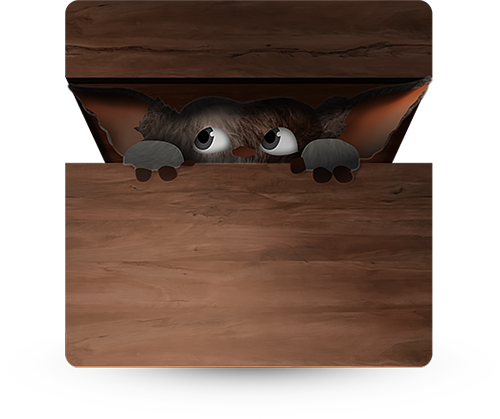

no_nav: true

<div class="text-center">
    <p>
        <br><br>
        
    </p>
</div>

# GREMLIN.JS <small>dead simple web components</small>

<div class="lead">
GREMLIN.JS is a dependency-free library to build web components. Web components for boringly normal websites, all your
websites. Webapps are not for everyone and everything, but modular and well organized code is.
</div>

## How does it feel?


**Add a custom dom element**

``` html
<hello-gremlin>
  <p data-content></p>
</hello-gremlin>
```

**Add a spec**

``` javascript
gremlins.create({
  name: 'hello',
  initialize: function(){
    this.el.querySelector('[data-content]').textContent = 'Hello World!';
  }
});
```

**done**

<div class="well well-sm">
    <hello-gremlin>
      <span data-content></span>
    </hello-gremlin>
</div>

<script>
gremlins.create({
  name: 'hello',
  initialize: function(){
    this.el.querySelector('[data-content]').textContent = 'Hello World!';
  }
});
</script>

## Installation

### NPM

    $ npm install gremlins --save
    
### Bower

    $bower install gremlins
    
### Globals

     <script src="gremlin.min.js" />